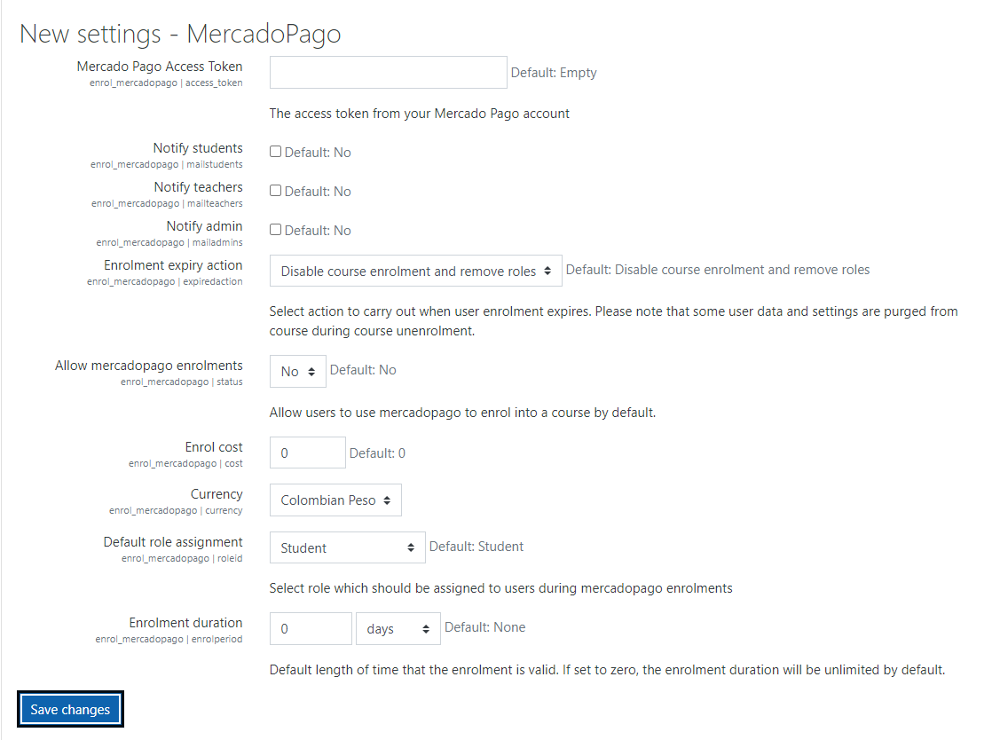
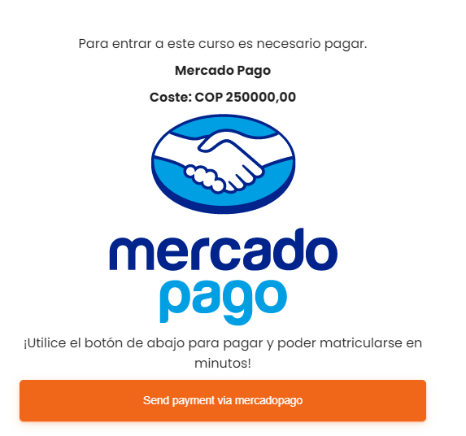
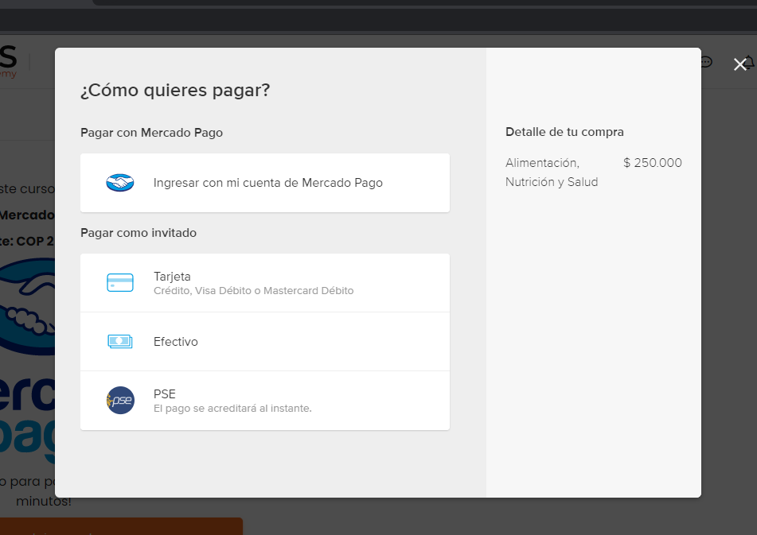

Moodle Enrollment MercadoPago 
===============================

Arrby Mercado Pago Enrollment is a enrolment plugin that allow mercadopago payment.

Documentation
=============

For sandbox testing use the following variables
- $CFG->usemercadopagosandbox = true
- $CFG->mercadopagosandbox_email = 'emailtest@test.com'
____________________________________________________________________________
This plugins use MercadoPago SDK PHP
https://www.mercadopago.com.co/developers/en/guides/sdks/official/php/
_____________________________________________________________________________
Generate users tests
https://www.mercadopago.com.co/developers/en/guides/qr-code/final-steps/integration-test/

Developed and maintained by
===========================
Hernan Arregoces
 - Software Engineer

Moodle profile: https://moodle.org/user/profile.php?id=1931915

Linkedin: https://www.linkedin.com/in/hernanarregoces/

Installation
------------

**First way**

- Clone this repository into the local folder.

**Second way**

- Download this repository
- Extract the content
- Put the folder into the local folder of your moodle
